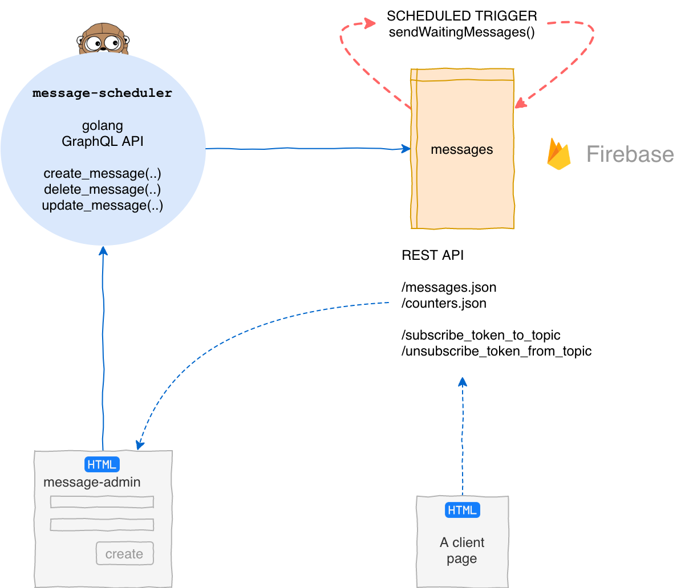

message-scheduler
==================

Это приложение реализует GraphQL API, используемый для рассылки уведомлений RGRU.

Общая часть
===========

Цель проекта - рассылка уведомлений подписчикам rg.ru.

Код проекта хранится в трех репозиториях:

- https://git.rgwork.ru/ivlev/message-scheduler
- https://git.rgwork.ru/ivlev/firebase-messaging
- https://git.rgwork.ru/ivlev/message-admin

За более подробными сведениями  обращайтесь к README конкретного репозитория. 

Предпосылки
-----

В предыдущей реализации рассылки сообщений уведомления посылались каждому 
подписчику отдельно, что требовало более 1.5 млн запросов на каждое сообщение. 

В данной реализации используются механизм подписки на **топики**.
Один вызов API порождает сообщение, 
которые получат все **подписчики толика**.
Таким образом, необходимое для рассылки количество запросов уменьшается примерно в миллион раз.

Схема приложения
----------
Приложение состоит из 4-х частей: 
1. Go приложение реализующее GraphQL API, для создания, редактирования и удаления сообщений. Git: [message-scheduler]().

2. Firebase приложение для рассылки и хранения посланных 
и запланированных сообщений. Git: [firebase-messaging]().

3. Клиентская javascript библиотека подключается к HTML страницам
клиентского веб приложения.
 Отвечает за подписку/отписку пользователя на выбранный топик. Git:
 [firebase-messaging]().

4. Статическое HTML приложение для тестирования firebase-messaging. 
 Git проект [message-admin]().

Принцип работы
--------

**Отправка сообщений с задержкой**

Сообщения отправляются с задержкой, чтобы иметь время для коррекции или отмены сообщения.

1. Редактор, пользуясь приложением **message-admin**, вызывает функцию 
`create_message()` приложения **message-scheduler** 
указав запланированную задержку отправки сообщения (`wait`).

2. Функция **message-sheduler** `create-message()` порождает запись 
в коллекции сообщений `messages` базы данных Firebase. Firebase 
дополняет новую запись полями статуса сообщения и запланированного времени  
 отправки (`status=scheduled, scheduled_time=timestamp+wait`).

3. Триггер Firebase sendWaitingMessages() каждую минуту проверяет
таблицу `messages` на наличие сообщений подлежащих отправке (status=scheduled),
и если время подошло (now > scheduled_time) отправляет сообщение, изменяя его
статус на `status=sent` 

4. Клиентские приложениям подписанные на данный топик, получают сообщения.

message-sheduler GraphQL API
----------------------------

- `create_message( to, message, link, icon, wait, user_email )` 
- `update_message( message_id, to, message, link, icon, wait, user_email )`
- `delete_message( message_id)`

Firebase REST API
------------------

- <https://rg-push.firebaseio.com/messages.json?print=pretty> - возвращает список сообщений
- <https://rg-push.firebaseio.com/counters.json?print=pretty> - возвращает значения счетчиков
- <https://us-central1-rg-push.cloudfunctions.net/subscribe_token_to_topic> - подписывает токен на топик, возвращает ok или ошибку
- <https://us-central1-rg-push.cloudfunctions.net/unsubscribe_token_from_topic> - отписывает токен от топика, возвращает ok или ошибку
- <https://us-central1-rg-push.cloudfunctions.net/send_scheduled_messages> - немедленно отправляет запланированные сообщения, время которых настало.

Клиентская Javascript библиотека
-------------------------------

Javascrit файл `public/js/topic-subscription.js` проекта 
[firebase-messaging](https://git.rgwork.ru/ivlev/firebase-messaging), 
должен быть подключен к HTML странице, для подписки/отписки на топики и обработки поступающих уведомлений. 

----------------------

 
 
 
 

Конкретная часть 
======================

#### setup

#### Development

 
#### Deploy

